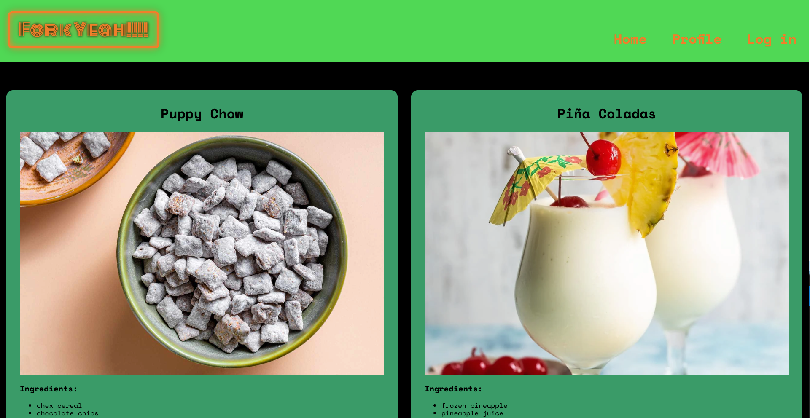

# Fork Yeah!!!!

## Description
Fork Yeah – Fork Yeah is a dynamic platform where you can share, discover, and explore a vast array of recipes. Fork Yeah allows users to post their favorite recipes, complete with photos, ingredients, and detailed instructions.

## Deployed Application

[Deployed Application](https://msu-fork-yeah-d9a4d1d2afa6.herokuapp.com/)

## Installation
N/A

## Usage
WHEN I visit the site for the first time
THEN I am presented with the homepage, which includes existing recipes, navigation links, and the option to log in 
WHEN I click on any links on the site 
THEN I am prompted to either sign up or sign in 
WHEN I sign-up 
THEN my user credentials are saved and I am logged into the site 
WHEN I try to sign in after my account has been created 
THEN as long as my username and password are correct, I am able to sign in 
WHEN I am signed in to the site 
THEN I can visit the links in the site, as well as add my own recipes 
WHEN I click on the button to add a recipe 
THEN I am prompted to enter a name, ingredients, instructions, and a photo 
WHEN I submit my recipe 
THEN it appears on the homepage and my profile 
WHEN I click on the profile link in the navigation 
THEN I am taken to my profile to see all my recipes 
WHEN I click on a recipe 
THEN I am taken to a page with that recipe, and if it is my recipe, I am able to delete it 
WHEN I click the delete button on one of my recipes 
THEN it is removed from the homepage and my profile 
WHEN I click on the logout option in the navigation 
THEN I am signed out of the site

## Credits
This web application was designed by: 
Finn Lambouris - [finntendoverse](https://github.com/finntendoverse) 
Shawn Carlson - [OxMagnus](https://github.com/OxMagnus) 
Peyton Brimmer - [PeytonBrimmer](https://github.com/PeytonBrimmer) 
Taaj Logan - [TaajL](https://github.com/TaajL)

## Contributing
Fork the repository 
Create a new branch for your feature or bugfix: git checkout -b my-new-feature 
Make your changes and commit them: git commit -am 'Adding my new feature' 
Push your changes to your forked repository: git push origin my-new-feature 
Create a new pull request from your forked repository to the original repository

## License
This project is released under the MIT License. See the LICENSE file for details.